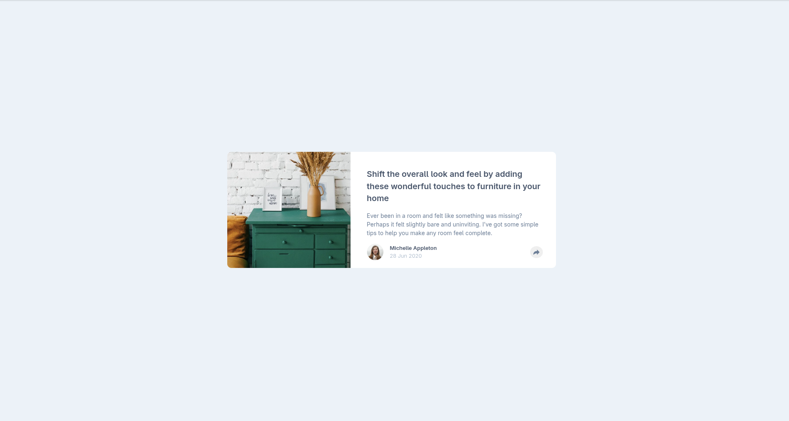

# Frontend Mentor - Article preview component solution

This is a solution to the [Article preview component challenge on Frontend Mentor](https://www.frontendmentor.io/challenges/article-preview-component-dYBN_pYFT). Frontend Mentor challenges help you improve your coding skills by building realistic projects.

## Table of contents

- [Overview](#overview)
  - [The challenge](#the-challenge)
  - [Screenshot](#screenshot)
  - [Links](#links)
- [My process](#my-process)
  - [Built with](#built-with)
  - [What I learned](#what-i-learned)
  - [Continued development](#continued-development)
- [Author](#author)

## Overview

### The challenge

Users should be able to:

- View the optimal layout for the component depending on their device's screen size
- See the social media share links when they click the share icon

### Screenshot



### Links

- Solution URL: [GitHub Repo](https://s4zco.github.io/article-preview-component-frontent-mentor/)
- Live Site URL: [Live site URL](https://your-live-site-url.com)

## My process

### Built with

- Semantic HTML5 markup
- CSS custom properties
- Flexbox
- CSS Grid
- Mobile-first workflow

### What I learned

CSS triangles with borders:
I learned how to create a tooltip arrow using only CSS borders. When an element has width: 0 and height: 0, each border becomes a triangle. Setting three of them to transparent leaves only the one you need visible.

```css
.article__share-element::after {
  content: "";
  width: 0;
  height: 0;
  border: 8px solid transparent;
  border-top-color: var(--clr-bg-share);
}
```

`aria-hidden` and `focusable` on decorative SVGs:
When an SVG is purely decorative and the button already has a label, the SVG should be hidden from screen readers with aria-hidden. focusable="false" is needed specifically for IE/Edge where SVGs are focusable by default.

```html
<svg aria-hidden="true" focusable="false" ...></svg>
```

`aria-label` for icon-only buttons:
A button with only an SVG inside has no visible text, so screen readers have nothing to read. aria-label provides a meaningful description that only assistive technology uses.

```html
<button aria-label="Share on Twitter">
  <svg aria-hidden="true" focusable="false" ... />
</button>
```

`aria-expanded` for toggle elements:
When a button controls a panel that opens and closes, aria-expanded communicates the current state to screen readers. Without it, a screen reader user has no way of knowing if the panel is open or closed.

```html
<button
  aria-label="Share article"
  aria-expanded="false"
  class="article__share-button"
></button>
```

```js
shareButton.addEventListener("click", () => {
  const isOpen = detailsElement.classList.contains("share");
  shareButton.setAttribute("aria-expanded", !isOpen);
});
```

### Continued development

Responsive behavior without JavaScript:
I want to keep exploring how much behavior can be handled purely with CSS across breakpoints, reducing the need for JS to detect screen sizes. This project showed me that JS should only manage state and CSS should handle how that state looks at each breakpoint.

## Author

- Frontend Mentor - [@S4ZCO](https://www.frontendmentor.io/profile/S4ZCO)
- Twitter - [@s4zco_Dev](https://x.com/s4zco_Dev)
